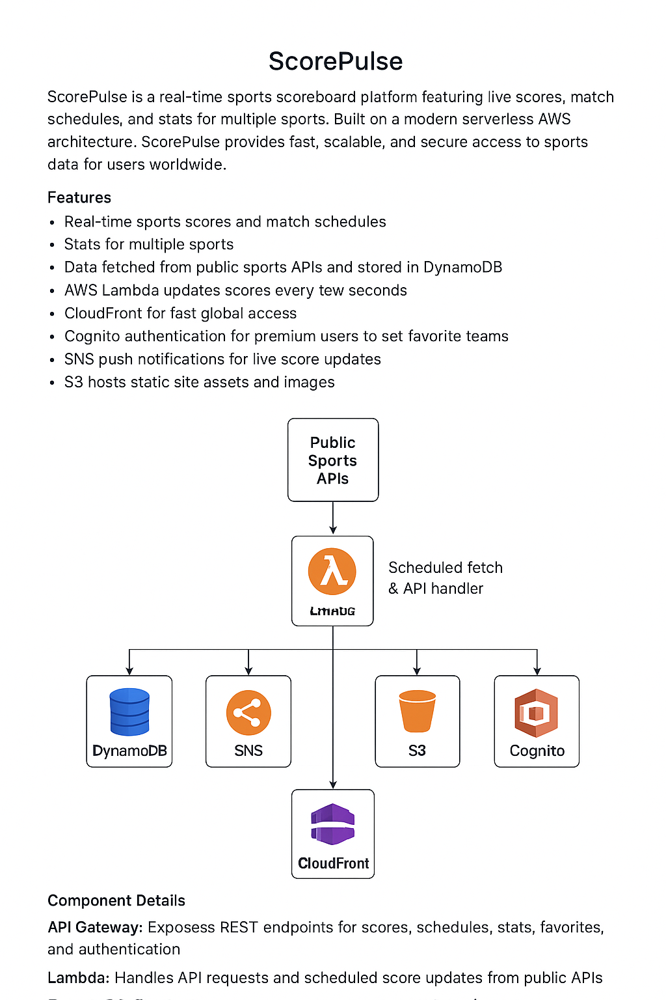

# ScorePulse

ScorePulse is a real-time sports scoreboard platform featuring live scores, match schedules, and stats for multiple sports. Built on a modern serverless AWS architecture, ScorePulse provides fast, scalable, and secure access to sports data for users worldwide.

## Features
- Real-time sports scores and match schedules
- Stats for multiple sports
- Data fetched from public sports APIs and stored in DynamoDB
- AWS Lambda updates scores every few seconds
- CloudFront for fast global access
- Cognito authentication for premium users to set favorite teams
- SNS push notifications for live score updates
- S3 hosts static site assets and images

## Architecture Overview

```
					 +-------------------+
					 |   Public Sports   |
					 |      APIs         |
					 +-------------------+
								  |
								  v
					 +-------------------+
					 |   AWS Lambda      |<-- Scheduled fetch & API handler
					 +-------------------+
					  |           |         |         |
					  v           v         v         v
			+-----------+   +--------+  +-----+  +--------+
			| DynamoDB  |   |  SNS   |  | S3  |  | Cognito|
			+-----------+   +--------+  +-----+  +--------+
					  |           |         |         |
					  v           v         v         v
			  +------------------------------------------+
			  |         API Gateway (REST)               |
			  +------------------------------------------+
								  |
								  v
					 +-------------------+
					 |   CloudFront      |
					 +-------------------+
								  |
								  v
					 +-------------------+
					 |   User Browser    |
					 +-------------------+
```

### Component Details
- **API Gateway**: Exposes REST endpoints for scores, schedules, stats, favorites, and authentication.
- **Lambda**: Handles API requests and scheduled score updates from public APIs.
- **DynamoDB**: Stores scores, schedules, stats, and user favorites.
- **Cognito**: Manages user authentication and premium access.
- **SNS**: Sends push notifications for live score updates.
- **S3**: Hosts static frontend assets and images.
- **CloudFront**: Distributes the frontend globally for fast access.
- **IAM**: Secures resources with fine-grained roles and policies.
- **CloudWatch**: Monitors logs and metrics for all services.

## Deployment Instructions

### Prerequisites
- AWS account with permissions for Lambda, API Gateway, DynamoDB, Cognito, SNS, S3, CloudFront, IAM, and CloudWatch
- AWS CLI and AWS SAM CLI installed
- Node.js and npm installed (for frontend)

### Backend Deployment (AWS SAM)
1. Navigate to the backend infrastructure folder:
	```
	cd backend/infrastructure
	```
2. Build the SAM application:
	```
	sam build
	```
3. Deploy the stack (guided mode):
	```
	sam deploy --guided
	```
4. Note the outputs for API Gateway URL, Cognito User Pool ID, and SNS Topic ARN.

### Frontend Deployment
1. Navigate to the frontend folder:
	```
	cd frontend
	```
2. Install dependencies:
	```
	npm install
	```
3. Update `src/aws-exports.js` with the values from the backend deployment (API endpoint, Cognito IDs, etc).
4. Build the frontend:
	```
	npm run build
	```
5. Upload the build output (`build/` folder) to the S3 bucket created by the backend stack.
6. In AWS Console, invalidate the CloudFront cache to update the site globally.

### Monitoring & Management
- Use AWS CloudWatch for logs and metrics.
- Manage users and permissions in AWS Cognito and IAM.
- Update environment variables and configuration as needed for API keys and endpoints.

---
Replace any placeholder assets, API keys, or configuration with your own as needed.
